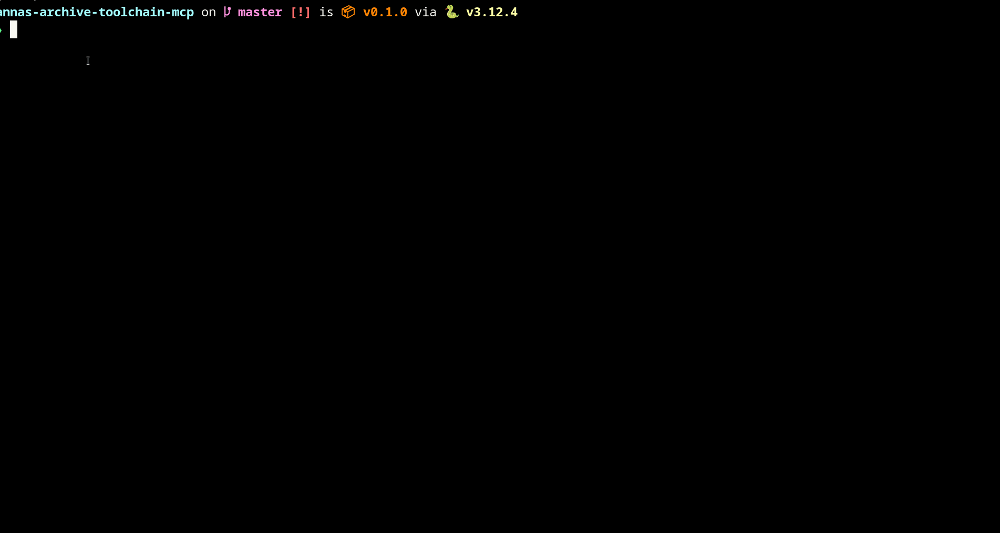

# Anna's Archive Toolchain (Typer CLI + Chroma)

**Human-friendly, robust, and RAG-ready CLI for Anna's Archive** — search the live catalog, download reliable artifacts, normalize them to Markdown, and ingest chunks into Chroma so retrieval-augmented generation just works. Built as a Typer CLI with Playwright-powered search, fast MD5 downloads, Markdown normalization, and semantic search over EPUB/PDF/MOBI content.



## Why this toolchain
- **Accurate catalog search**: Rich-rendered results with verified metadata (format, size, language, year) for fast triage.
- **Reliable downloads**: Fast-download routing with retries, extension validation, MOBI→HTML conversion, and Markdown generation via `unstructured`.
- **RAG-first ingestion**: Optional chunking straight into Chroma collections for semantic search and grounded answers.
- **Typed & tested**: Pyright strict, pytest live-paths, and explicit Typer options (no hidden state).

## Quick start
```bash
uv sync
# Set env (or .env): ANNAS_SECRET_KEY, ANNAS_DOWNLOAD_PATH
uv run python -m annas.cli search-catalog plato --limit 5
uv run python -m annas.cli download <md5> --work-dir /tmp/annas --collection my-chroma
uv run python -m annas.cli search-downloaded-text <md5> "needle" --work-dir /tmp/annas
uv run python -m annas.cli store query-collection my-chroma "Republic" --work-dir /tmp/annas
```

## Features (status)
- [x] Rich-powered `search-catalog` table with clickable titles and precise metadata.
- [x] Fast-download with retry/backoff, md5 validation, format detection, MOBI conversion.
- [x] Markdown normalization with page markers, titles, and list handling.
- [x] Chroma ingestion + metadata inspection + text querying (`store` subcommands).
- [x] Strict typing (Pyright) and Black formatting.
- [ ] MCP server surface (planned).

## Commands at a glance
| Command | What it does |
| --- | --- |
| `annas search-catalog QUERY --limit N` | Live Anna’s Archive search with rich, linkable results. |
| `annas download MD5 [--collection NAME]` | Download, validate, normalize to Markdown, optional Chroma ingest. |
| `annas search-downloaded-text MD5 NEEDLE` | Pull contextual Markdown snippets from cached downloads. |
| `annas store metadata COLLECTION [--md5s ...]` | Inspect stored chunk metadata in Chroma. |
| `annas store query-collection COLLECTION QUERY [--md5s ...]` | Semantic search over ingested chunks for grounded context. |

## Architecture (data flow)
1. **Search**: Playwright-backed scraper normalizes results into `SearchResult` records.
2. **Download**: Fast-download API with retries writes artifacts, validates extensions, converts MOBI/AZW → HTML when needed.
3. **Normalize**: `unstructured.partition` → `_elements_to_markdown` adds headings, lists, and page markers.
4. **Ingest (optional)**: `store.load_elements` chunks Markdown to Chroma with rich metadata (title, author, pages, tags, size).
5. **Retrieve**: `search-downloaded-text` for exact snippets; `store.query-collection` for semantic hits.

## Roadmap
- [ ] MCP server parity with CLI surface.
- [ ] Pre-warmed NLTK data cache to avoid first-run downloads.
- [ ] Additional format heuristics for edge-case archives.

## Prior art / Inspiration
- `annas-mcp` by iosifache — MCP server exposing Anna’s Archive tools: https://github.com/iosifache/annas-mcp

## Requirements
- Python 3.11+
- `ANNAS_SECRET_KEY` (for fast downloads)
- `ANNAS_DOWNLOAD_PATH` (writable workspace)
- Playwright Chromium available for live search.

## Testing & quality
- `uv run --extra dev pyright`
- `uv run black .`
- `uv run pytest -q` (network + secrets required for live paths)
